# Data Migration Solution - Cloud Architecture

This project showcases a modern, scalable, and robust solution for data migration using cutting-edge cloud technologies. The solution was initially prototyped locally using **PostgreSQL**, and later migrated to **Azure** to take advantage of cloud scalability and modern tools like **Azure Blob Storage**, **Azure Data Lake Gen 2**, **Docker**, **Azure Web Apps**, and **Azure Databricks**.

The goal was to simulate a migration from one storage system to another, maintaining data quality and providing valuable business insights through a **Power BI** dashboard. The solution follows a **Data Lakehouse** model, where the data is processed across three stages: **Bronze**, **Silver**, and **Gold**.

## Project Overview

The architecture of the project is divided into three main layers:

- **Bronze Layer**: Raw data ingestion, where unfiltered data is initially stored.
- **Silver Layer**: Data cleaning, filtering, and transformation to enrich the dataset.
- **Gold Layer**: Business-ready data prepared for reporting and insights.

### Architecture Diagram

---

### Detailed Breakdown of the Architecture

1. **Source**: Data is ingested from various sources like **Docker Containers**, **Azure API Apps**, and **Azure Blob Storage**.
2. **Bronze**: This layer is dedicated to raw data ingestion.
3. **Silver**: Data undergoes cleaning, filtering, and augmentation in this stage.
4. **Gold**: The business-ready, processed data is stored in the Gold layer for final reporting and analysis.
5. **Reporting**: Data is visualized using **Power BI**, with **Delta Logs** tracking changes.

---

## Steps in the Solution Implementation

### Step 1: Local Prototype

Initially, I created a **local solution** using **PostgreSQL** to quickly test the core functionality of the data migration process. This approach helped validate the data flow and proved that the solution would work before scaling it to the cloud.

### Step 2: Transition to Cloud Architecture

After the prototype was validated, I migrated the solution to **Azure Cloud**, leveraging its scalability and modern cloud components:

- **Azure Blob Storage** for raw data storage.
- **Azure Data Lake Gen 2** for data processing and storage.
- **Azure Databricks** for data transformation and leveraging **Delta Lake**.
- **Power BI** for reporting.

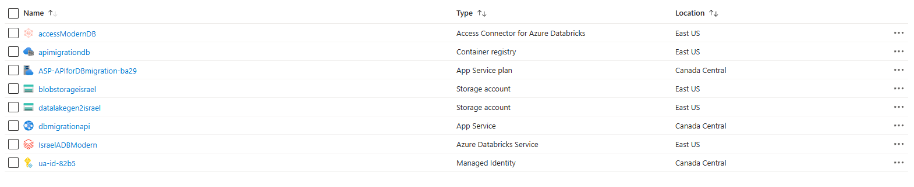

---

### Step 3: API for File Upload

I developed a **FastAPI** application to facilitate the migration of files from **Azure Blob Storage** to **Azure Data Lake Gen 2**. The FastAPI app serves as the bridge to upload and manage the data migration process, simulating a modern cloud migration workflow.

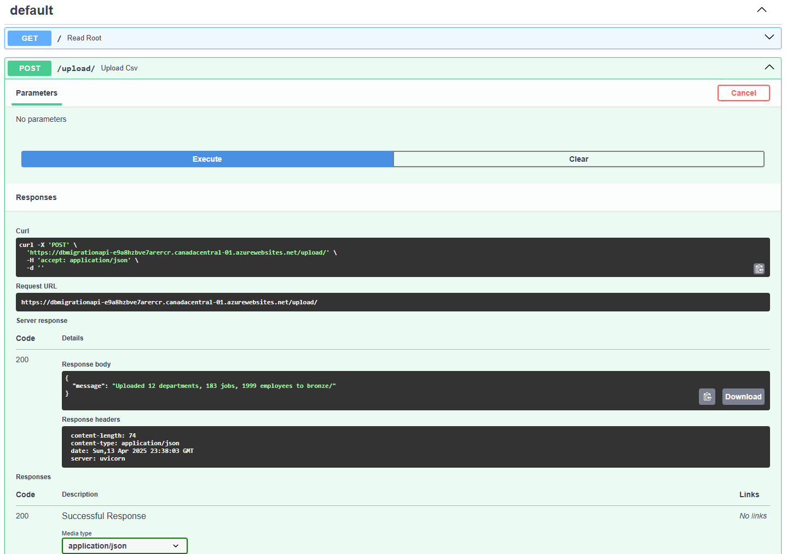

This API ensures secure, efficient, and seamless migration of files while maintaining the same format between the source and destination storage systems.

### Step 4: Dockerization

To make the application portable and scalable, I dockerized the FastAPI application. After creating the Docker image, I pushed it to Azure Container Registry for easy deployment. The solution was then deployed on Azure Web App for testing and use.

Docker was used to encapsulate the entire application for consistency across different environments.

Linux Plan was used to host the Docker container efficiently on Azure.

Managed Identity was employed to ensure secure, seamless communication between the application and other Azure services.

---

### Step 5: Integration with Azure Databricks

Once the data was ingested into Azure Data Lake, I integrated Azure Databricks for data processing:

Azure Databricks Service: Set up to perform data transformations.

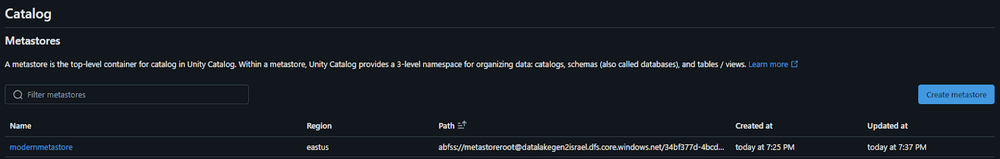

Access Connector: Used for seamless integration with Azure Data Lake Gen 2, allowing me to create Managed Tables for data governance.

Unity Catalog: Activated in Databricks for better control and management of external tables.

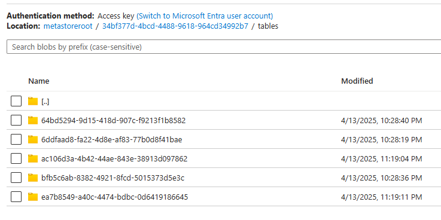

### Step 6: Data Transformation in Databricks

In Azure Databricks, I used Delta Lake for efficient data processing and transformations:

Bronze Notebook: Ingested raw data and performed the initial cleaning.

Silver Notebook: Applied necessary transformations and joins to clean and enrich the data.

Gold Notebook: The final business-ready data was created for reporting and analysis.

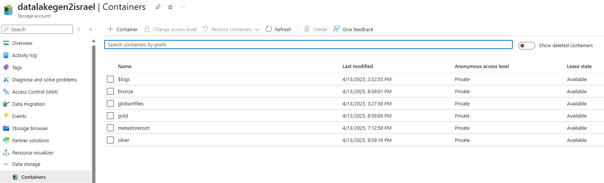

### Step 7: Power BI Integration and Delta Logs

Finally, I connected the transformed data from Azure Databricks to Power BI for reporting. This allowed for the creation of interactive dashboards and insights, leveraging the business-level data in the Gold Layer.

Moreover, Delta Logs were generated in Delta Lake to ensure data traceability and track every change made to the datasets.

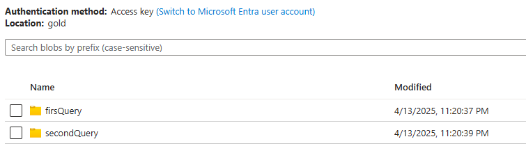

### Additional Images

- First Query:

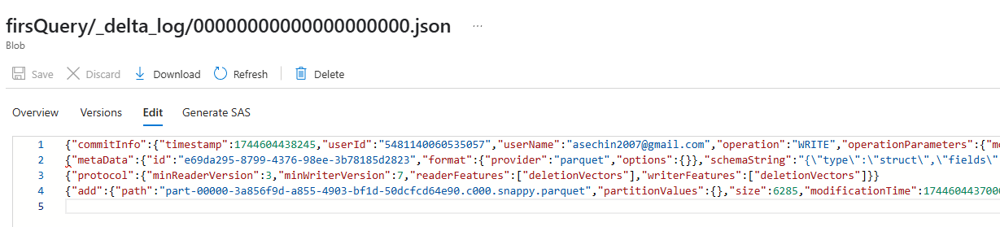

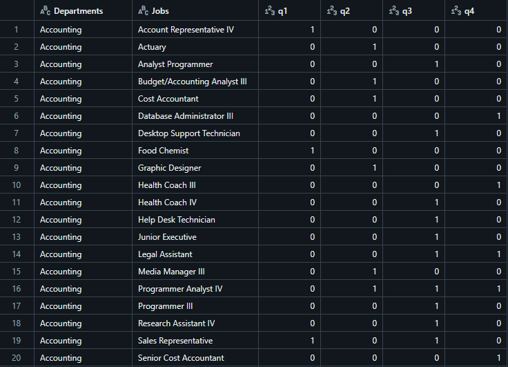

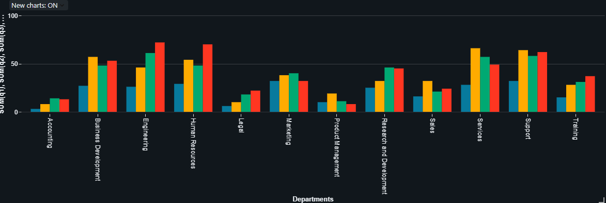

- Second Query:

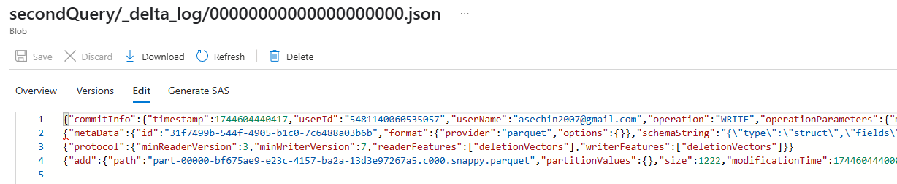

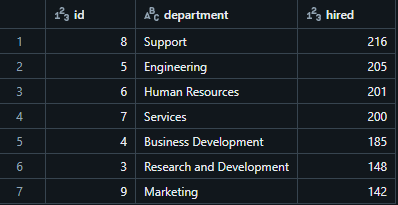

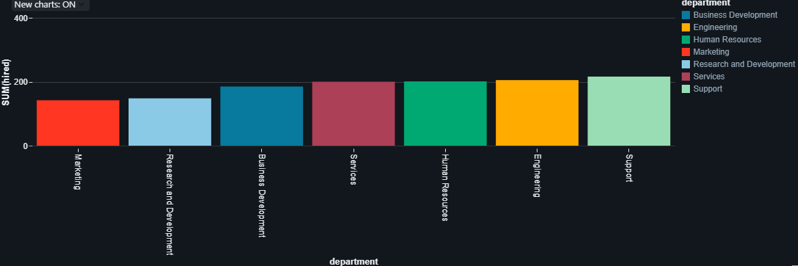

Thanks!